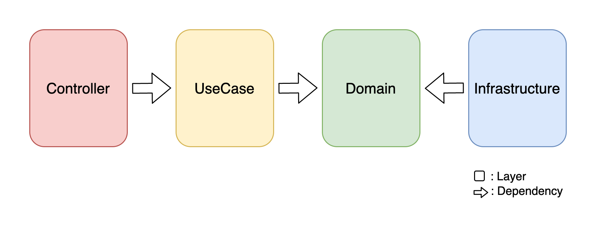
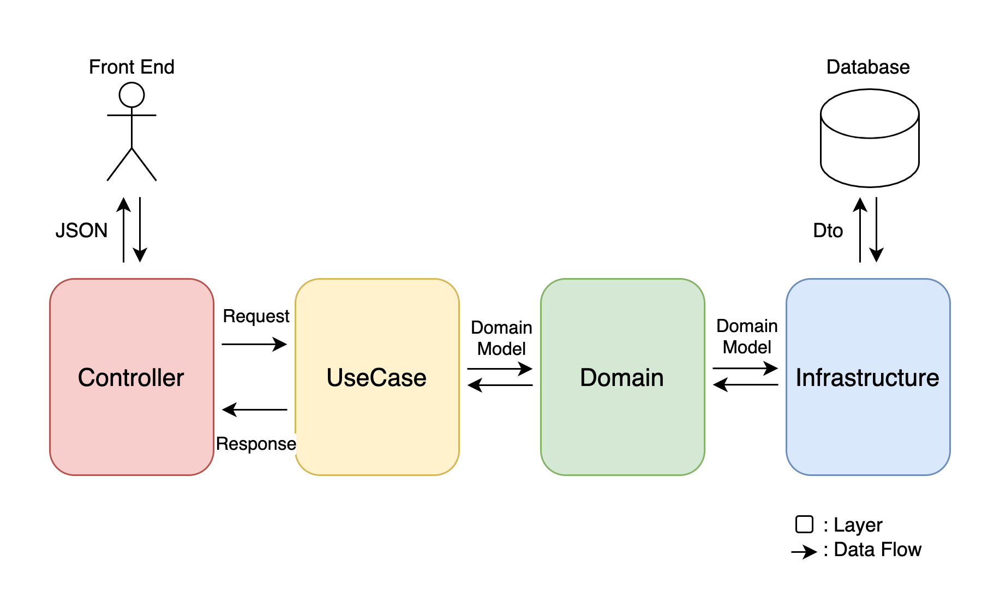

# 設計方針

## レイヤードアーキテクチャ

本アプリケーションは、以下に示すそれぞれの層をcrateとし、
それらを取りまとめる[Cargo Workspace](https://doc.rust-lang.org/book/ch14-03-cargo-workspaces.html)として実装されている。

* **Controller**: 外部へのインターフェスとなる層
  * ルーティング
  * リクエストのバリデーション
  * UseCaseレイヤーの呼び出し
* **UseCase**: アプリケーションの手続きの流れを表現する層
  * Domainレイヤの操作
  * `Request` / `Response` 構造体の定義、生成
  * トランザクション管理
  * この層では極力流れの表現に注力し、ロジックは`Domain`や`Infrastructure`に逃すべき
* **Domain**: 業務上登場する概念やロジックをまとめた層
* **Infrastructure**: ミドルウェアや外部APIとの繋ぎこみロジックを表す層
  * ミドルウェア/外部APIの呼び出し
  * 呼び出し結果のドメインモデルへの変換

## データの流れ

## `crate`設計
### component一覧
| crate            | rust component         | 説明 |
| ---------------- | ---------------------- | --- |
| `controller`     | `fn controller`        | RESTful APIの各エンドポイントを表現する関数 |
| `usecase`        | `trait UseCase`        | アプリケーションの手続きを表現   トランザクション管理   `Request`, `Response`と`DomainModel`との変換を行う |
|                  | `struct Request`       | `controller`から`UseCase`へ渡すデータオブジェクト   jsonから`Deserialize`される   validationはここで行うべき |
|                  | `struct Response`      | `UseCase`から`controller`へ渡すデータオブジェクト   jsonへ`Serialize`される |
| `domain`         | `struct DomainModel`   | Modelとしての振る舞い（＝自身のデータで完結する操作）を記述 |
|                  | `struct DomainService` | 異なる`DomainModel`同士の相互作用を表現 |
|                  | `trait Repository`     | `infrastructure`でのデータアクセスロジックのインターフェス   取得したデータを`DomainModel`へと変換して返す |
|                  | `trait Api`            | 外部APIなどへのアクセスロジックのインターフェス   取得したデータを`DomainModel`へと変換して返す |
| `infrastructure` | `struct Repository`    | DBなどへのデータアクセスロジック   `domain::Repository`を実装 |
|                  | `struct Api`           | 外部APIなどへのアクセスロジック   `domain::Api`を実装 |

### 呼び出し規則
| ↓呼出元 \ 呼出先→      | `controller` | `UseCase` | `Request`/`Response` | `DomainModel` | `DomainService` | `trait Repository` | `trait Api` |
| -------------------  | --- | --- | --- | --- | --- | --- | --- |
| `controller`         | × | ⭕️ | ⭕️ | × | × | × | × |
| `UseCase`            | × | × | ⭕️ | ⭕️ | ⭕️ | ⭕️ | ⭕️ |
| `Request`/`Response` | × | × | × | ⭕️ | × | × | × |
| `DomainModel`        | × | × | × | ⭕️ （所有するモデルのみ） | × | × | × |
| `DomainService`      | × | × | × | ⭕️ | × | × | × |
| `struct Repository`  | × | × | × | ⭕️ | × | ⭕️ | × |
| `struct Api`         | × | × | × | ⭕️ | × | × | ⭕️ |
