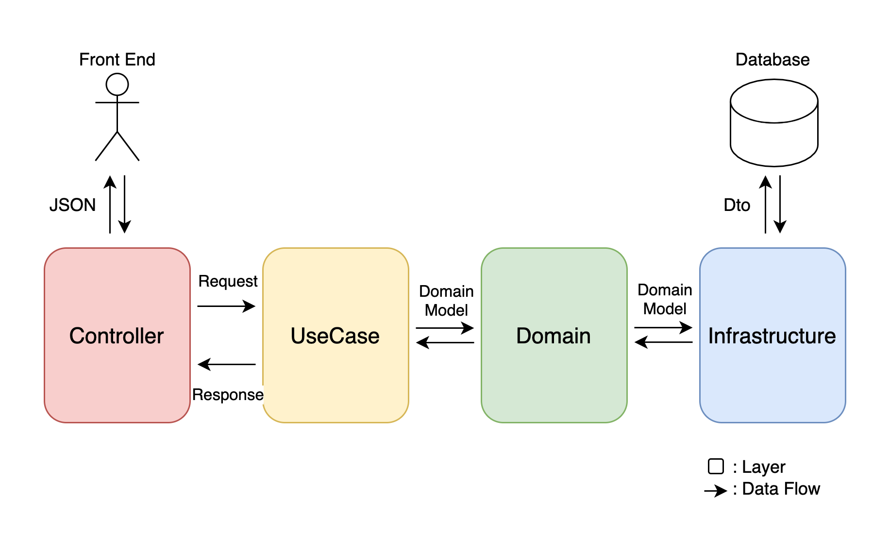

# Architecture and Design Policies

## Layered Architecture

This application is implemented as a [Cargo Workspace](https://doc.rust-lang.org/book/ch14-03-cargo-workspaces.html)
that brings together each of the following layers as a crate.

* **Controller**: A layer that serves as an interface to the outside world
    * Routing
    * Validation of the request
    * Calling the `usecase` layer
* **UseCase**: A layer that represents the procedures of the application
    * Manipulate the Domain layer 
    * Define and create the `Request` / `Response` struct
    * Transaction management
* **Domain**: A layer that consolidates the concepts and logic that appear in the business
* **Infrastructure**: Integration with middleware and external APIs
    * Calling middleware/external APIs
    * Transforms responses into domain models

## Data Flow

## `crate`, `struct` design
### `struct` list
| crate            | struct (or trait)   | description |
| ---------------- | ------------------- | --- |
| `controller`     | `Controller`        | controller for the RESTful API |
| `usecase`        | `UseCase`           | Represents application procedures   Transaction management   Perform conversion between `Request`/`Response` and `DomainModel` |
|                  | `Request`           | Data object to be passed from `Controller` to `UseCase`   Deserializable from json   Request validation should be done here. |
|                  | `Response`          | Data object to be passed from `UseCase` to `Controller`   Serializable to json |
| `domain`         | `DomainModel`       | Describes behavior as a Model (i.e., operations that are completed with its own data) |
|                  | `DomainService`     | Represents of the interaction between different `DomainModel` |
|                  | `trait Repository`  | Interfaces for data access logic in `infrastructure`   Converts the retrieved data to `DomainModel` and returns it |
|                  | `trait Api`         | Interfaces for access logic to external APIs, etc.   Converts the retrieved data to `DomainModel` and returns it |
| `infrastructure` | `Repository`        | Data access logic to DB, etc.   `impl domain::Repository` |
|                  | `Api`               | Access logic to external APIs, etc.   `impl domain::Api` |

### Access Rule
| ↓Caller \ Callee→      | `Controller` | `UseCase` | `Request`/`Response` | `DomainModel` | `DomainService` | `trait Repository` | `trait Api` |
| -------------------  | --- | --- | --- | --- | --- | --- | --- |
| `Controller`         | × | ⭕️ | ⭕️ | × | × | × | × |
| `UseCase`            | × | × | ⭕️ | ⭕️ | ⭕️ | ⭕️ | ⭕️ |
| `Request`/`Response` | × | × | × | ⭕️ | × | × | × |
| `DomainModel`        | × | × | × | ⭕️ (Owned models only) | × | × | × |
| `DomainService`      | × | × | × | ⭕️ | × | × | × |
| `Repository`         | × | × | × | ⭕️ | × | ⭕️ | × |
| `Api`                | × | × | × | ⭕️ | × | × | ⭕️ |
